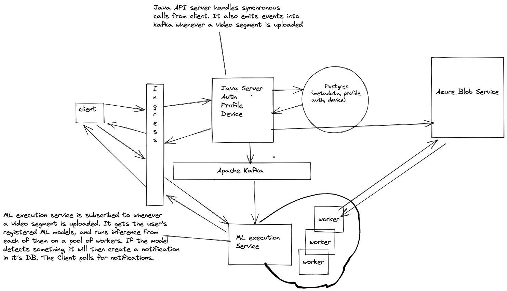

# Guard Dog

Demo:
WIP -> https://youtu.be/3AL_VbMAWHk

Computer Vision Infrastructure As A Service
Use my service to get multiple cameras on the cloud, upload your custom ONNX model and have automatic inference on videos as they come!

Features
- Auth & Profile
- stream videos from multiple devices to cloud
- View previously streamed videos with minimal latency
- Have users upload predefined ONNX models
- Run user defined ML models on a video for inference (WIP)
- Query recorded videos by datetime, have sessions arranged by devices (WIP)

Technical Specs:
- Java Spring Boot Server + JobRun for distributed background processing.
- Angular Typsecript Frontend
- Golang based ML execution service
- Postgres DB
- Onnx runtime to load user defined models for execution.

